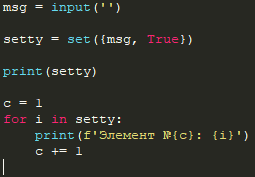

# ThemesForIDLEPython
<h5>Вам тоже не нравится тема по умолчанию для IDLE? Если вы забыли, как она выглядит, то вот:</h5>

Для смены темы в IDLE, вам нужно выполнить те же шаги, что и указанные на картинках:

Не знаю, как вы, а я не переношу светлую тему. Благо, в Python IDLE есть 
Решение для этого

Окей, это выглядит ужасно

Вот по этому я рекомендую вам добавить новые темы. Я собрал в этом репозитории 
самые лучшие. Для начала скачайте файл config-highlight.def (Указан в репозитории)

Скопируйте его

Перейдите в директорию вашего IDLE. (Вбейте в поиске IDLE и нажмите "Расположение файла")

Далее делайте так, как в прикреплённых картинках

Ищем папку Lib

Переходим в папку idlelib

Вставляем файл и жмём продолжить

Нажимаем "Заменить файл в папке назначения"

<h5>Готово! Ваши новые темы должны быть там же, где мы до этого изменяли их</h5>
<h5>Сейчас я покажу вам темы и то как они выглядят:</h5>

Flash BLACK

As Pycharm

